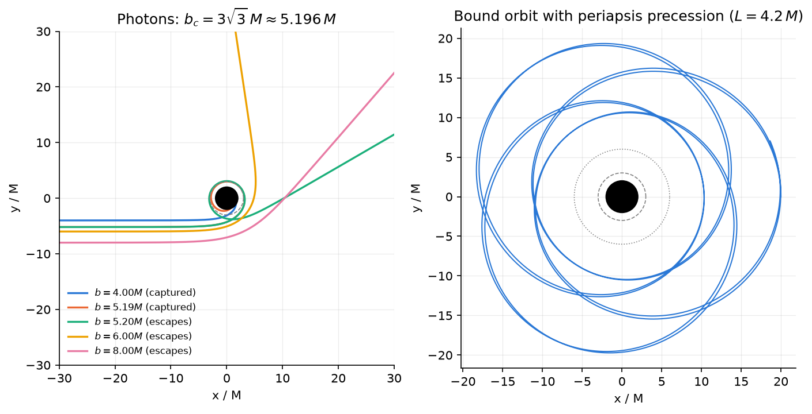
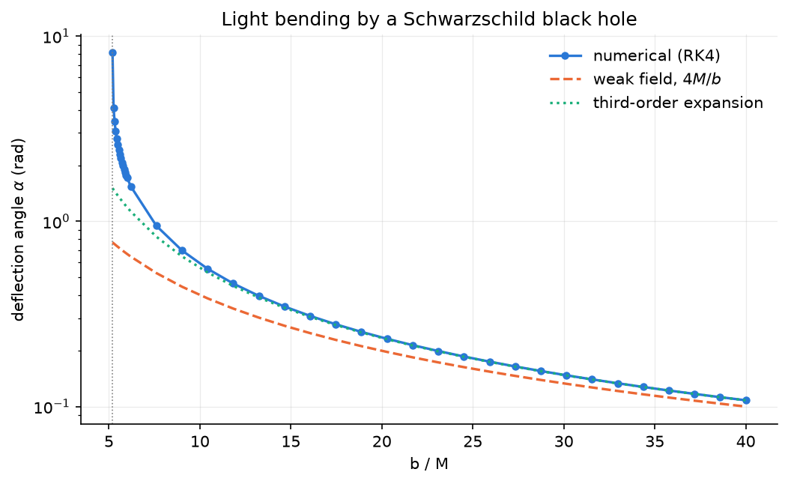

# schwarzschild-geodesics

[](https://github.com/NugiePhysics/schwarzschild-geodesics/actions/workflows/ci.yml)
[](pyproject.toml)
[](LICENSE)
[](https://codespaces.new/NugiePhysics/schwarzschild-geodesics)

Numerical simulation of **massive particles and light rays orbiting a Schwarzschild black hole**, built from Hamilton's equations and integrated with a fourth-order Runge–Kutta (RK4) scheme. Every result is checked against a closed-form prediction.



*Left: photons with different impact parameters; those with $b < b_c = 3\sqrt{3}\,M$ are captured. Right: a bound orbit whose periapsis advances every revolution. The black disk is the horizon, the dashed circle the photon sphere ($3M$) and the dotted circle the ISCO ($6M$).*

## Features

- **Hamiltonian formulation.** The geodesic equations are written as four first-order ODEs, so there is no square root and no manual sign flip at turning points ([derivation](docs/derivation.md)).
- **One set of equations for particles and photons.** Mass enters only through the initial radial momentum, fixed by the constraint $H = -\epsilon/2$.
- **RK4 with an adaptive step near the horizon**, where $p_r$ and $\dot p_r$ diverge.
- **Built-in accuracy monitor.** The Hamiltonian constraint $\mathcal{C} = H + \epsilon/2$ must vanish along a geodesic and is recorded at every step.
- **Pluggable metric.** Any static, spherically symmetric $f(r)$ works: implement `f`, `df` and `horizon` (see [`metric.py`](src/schwarzschild/metric.py)).
- **Tested against analytic results**: Kepler's law, an elliptic-integral formula for periapsis precession, the critical impact parameter, weak-field light bending, and the $h^4$ convergence of RK4.

## Validation

| Check | Numerical | Analytical |
|---|---|---|
| Circular orbit $r_c = 10M$: $d\phi/dt$ | 0.0316227766 | $\sqrt{M/r_c^3} = 0.0316227766$ |
| Periapsis advance per orbit ($r_\text{apo} = 20M$, $L = 4.2M$) | 2.127094008 rad | 2.127093985 rad (elliptic integral) |
| Photon capture threshold | $b = 5.19M$ captured, $b = 5.20M$ escapes | $b_c = 3\sqrt{3}\,M \approx 5.196M$ |
| Light deflection at $b = 40M$ | 0.108104 rad | 0.108096 rad (4th-order weak-field series) |
| Global order of RK4 | 3.996 | 4 |
| Hamiltonian constraint $\lvert\mathcal{C}\rvert$ (bound orbit) | $\le 4\times10^{-16}$ | 0 |

All of these are asserted in the [test suite](tests/) and reproduced in the [notebook](notebooks/schwarzschild_simulation.ipynb).



## Quick start

```bash
git clone https://github.com/NugiePhysics/schwarzschild-geodesics.git
cd schwarzschild-geodesics
python -m venv .venv && source .venv/bin/activate
pip install -e ".[dev,notebook]"
jupyter lab notebooks/schwarzschild_simulation.ipynb
```

Or open it in the cloud with the Codespaces badge above; the dev container installs everything.

A minimal example:

```python
import matplotlib.pyplot as plt

from schwarzschild import energy_at_turning_point, integrate, photon_state
from schwarzschild.plotting import draw_black_hole

# Massive particle released at apoapsis r = 20M with angular momentum L = 4.2M
L = 4.2
E = energy_at_turning_point(20.0, L)
orbit = integrate([0.0, 20.0, 0.0, 0.0], E, L, eps=1.0, h0=0.05, lam_max=2600.0)
print(f"r in [{orbit.r.min():.3f}, {orbit.r.max():.3f}], max |C| = {abs(orbit.constraint).max():.1e}")

# Photon with impact parameter just above the critical value b_c = 5.196M
photon = integrate(photon_state(50.0, 5.20), 1.0, 5.20, eps=0.0, r_max=60.0)
print("photon:", photon.reason)  # "escaped"

fig, ax = plt.subplots()
ax.plot(*orbit.xy())
draw_black_hole(ax, isco=True)
plt.show()
```

## The physics in a minute

In Schwarzschild spacetime, $f(r) = 1 - 2M/r$, the equatorial geodesics follow from the Hamiltonian $H = \tfrac12 g^{\mu\nu}p_\mu p_\nu = -\epsilon/2$ ($\epsilon = 1$ for massive particles, $0$ for photons), with conserved energy $E = -p_t$ and angular momentum $L = p_\phi$. Hamilton's equations for the state $(t, r, \phi, p_r)$ become

$$
\dot t = \frac{E}{f}, \qquad
\dot r = f\,p_r, \qquad
\dot\phi = \frac{L}{r^2}, \qquad
\dot p_r = -\frac{f'}{2}\left(\frac{E^2}{f^2} + p_r^2\right) + \frac{L^2}{r^3},
$$

where the dot is the derivative with respect to the affine parameter (proper time for massive particles). The full derivation, including the radial effective potential, the choice of initial conditions and the RK4 scheme, is in [`docs/derivation.md`](docs/derivation.md) (also as [LaTeX](docs/derivation.tex); a PDF is attached to each release).

## Project structure

```
src/schwarzschild/
    metric.py              metric function f(r), horizon, effective potential
    equations.py           Hamilton's equations, Hamiltonian constraint
    integrators.py         RK4 step, adaptive integrate(), Trajectory result
    initial_conditions.py  p_r from the constraint, photon and turning-point setups
    analytic.py            closed-form results used for validation
    diagnostics.py         precession, deflection angle, convergence study
    plotting.py            plot style and helpers
tests/                     pytest suite
notebooks/                 walkthrough notebook (outputs included)
scripts/make_figures.py    regenerates docs/figures/
docs/                      derivation (Markdown + LaTeX) and figures
```

## Development

```bash
pip install -e ".[dev]"
pre-commit install          # ruff lint + format on every commit
pytest                      # unit and validation tests (a few seconds)
pytest --nbmake notebooks/  # execute the notebook end to end
python scripts/make_figures.py
```

CI runs the linters, the tests and the notebook on Python 3.10 to 3.14.

## Roadmap

- Other static metrics (Reissner–Nordström, Schwarzschild–de Sitter) through the existing `Metric` protocol
- Kerr spacetime
- A symplectic integrator to compare long-term energy drift with RK4
- Adaptive RK45 step control
- Full 3D photon ray tracing (the 8-equation system of [§11.5](docs/derivation.md) is already derived)

## Citation

If this code is useful in your work, please cite it. GitHub's "Cite this repository" button uses [`CITATION.cff`](CITATION.cff).

## License

[MIT](LICENSE) © 2026 Nugie Saputra
